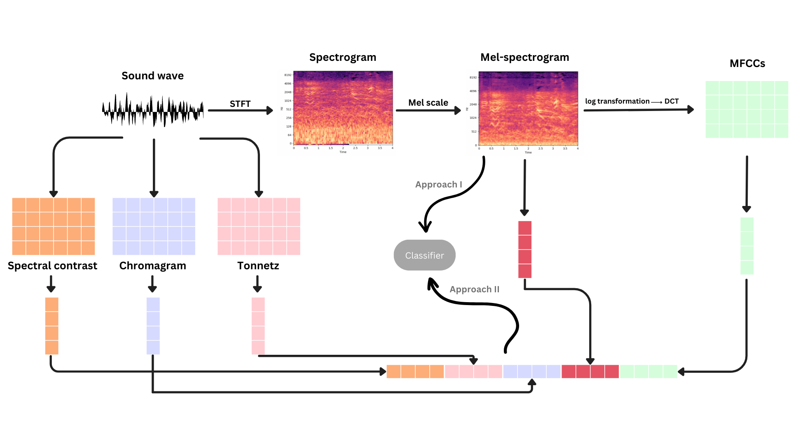

# Machine Learning-Based Gun Detection System for Urban Settings

This repository contains the Python code for a gun detection system designed to detect gunshots in urban settings. The system utilizes audio data analysis and machine learning algorithms to classify sounds and identify gunshots. It has several potential applications, including providing real-time information to law enforcement agencies about the location and nature of gunshots.

## Dataset

The dataset consists of 8732 labelled sound files, each with a length of less than or equal to 4 seconds. The sound files represent urban sounds from different scenarios. The sounds are classified into ten different classes: air conditioner, car horn, children playing, dog barking, drilling, idle engine, gunshot, jackhammer, siren, and street music.

For the current task, only one class is relevant out of the ten classes, the gunshot class. Detecting a gunshot sound is relevant to gunshot detection technology. By identifying and isolating the gunshot class from the rest of the urban sounds, machine learning models can be trained to recognize the unique acoustic characteristics of a gunshot sound.

## Applied approaches for feature extraction and model training

For this project, two approaches are implemented for comparison, Mel-spectrogram classification and multi-feature stacking. The following figure depicts the workflow design for both approaches. This section dives into the details of each approach.

### Approach 1: Mel-Spectrogram Conversion

In this approach, the sound files are converted into 2D Mel-spectrograms. To achieve this, for each audio clip, STFT is first used to convert the clip into spectrograms. Then, the frequency of the spectrogram is converted to the Mel scale. The resulting Mel-spectrogram is a two-dimensional image, which moves this task from audio classification into the image classification paradigm. The images is then be fed into a 2D CNN for classification.

The 2D CNN model was trained and evaluated on the resulted images for classification. Although the model achieved a 73% accuracy in classifying sounds into any of the ten classes, it performed poorly in identifying the target class, i.e., gunshot sounds. Therefore, this approach was found unsuitable for the current task.

### Approach 2: Feature Extraction and 1D CNN

The second approach follows the multi-feature stacking techniques discussed in [[1]](https://www.researchgate.net/publication/365912955_Multi-feature_stacking_order_impact_on_speech_emotion_recognition_performance). This method involves stacking multiple features extracted from the audio clip into a one-dimensional array. Five features are computed from each audio: Mel-spectrogram, MFCCs, spectral contrast feature, chromagram and tonnetz. Each of these features will be then converted from a 2D matrix to a 1D array by taking the mean across the vertical axis. The authors in [[1]](https://www.researchgate.net/publication/365912955_Multi-feature_stacking_order_impact_on_speech_emotion_recognition_performance) stress the fact that the orders in which these features are stacked are significantly impactful on the final result. Therefore, following their recommended order, the 5 features are horizontally stacked in the following order: spectral contrast, tonnetz, chromagram, Mel-spectrogram, and MFCC. The resulting vectors are then inputted into the classifier.

Two different classification models are trained for comparison, Support vector machine (SVM) and a 1D CNN. During validation, the CNN outperformed the SVM with validation accuracy scores of 86% and 75%, respectively. The CNN model was then evaluated on the test set, and it achieved 80% accuracy in identifying sounds and 99% when examined for the target class.

**Based on these results, the 1D CNN model trained on the stacked feature vectors (approach 2) was decided to be the best approach for the detection of gunshot sounds in urban settings.**

## Model Inferencing

When applied to unseen sound clips obtained from the internet, the 1D CNN model achieved an accuracy of 80%. Although slightly lower than the accuracy on the test set, it is still considered satisfactory. The precision score for the target class was 100%, indicating a lack of false positives. However, the recall score for the target class was only 50%, suggesting that the model may require further improvement to increase its sensitivity in detecting gunshot sounds.

## Repository Structure

- `audio/`: Acts as a place holder for the labeled sound files used for training and evaluation.
- `data-description.csv`: Contains a description of all audio files included in the dataset.
- `preprocessing.py`: Includes code for cleaning, preprocessing, and resampling the audio data.
- `feature_extraction.py`: Implements the different feature extraction techniques followed for both approaches.
- `model_training_and_testing.py`: Contains the training, evaluation and testing for both approaches.
- `workflow-design.png`: Diagram of the workflow design for both approach I and approach II.

## Conclusion

This gun detection system offers a foundation for identifying gunshots in urban environments. The two approaches explored in this repository provide insights into different methodologies for sound processing and audio classification. By leveraging this code, you can further enhance the system's performance and contribute to the important task of gunshot detection and prevention.

## References

[1] Y. Tanoko and A. Zahra, “Multi-feature stacking order impact on speech emotion recognition performance,” Bulletin of Electrical Engineering and Informatics, vol. 11, no. 6, pp. 3272–3278, Dec. 2022, doi: 10.11591/EEI.V11I6.4287.
